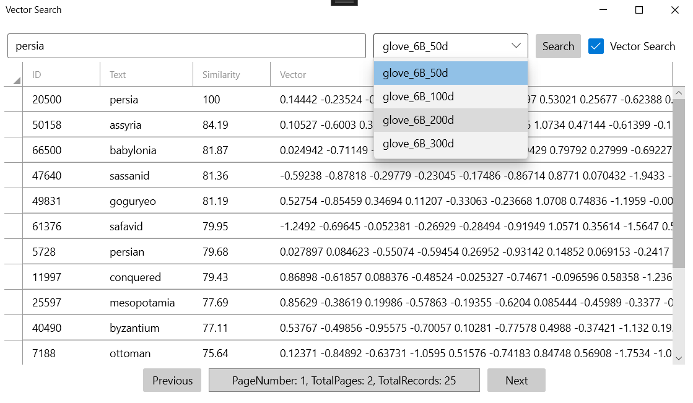
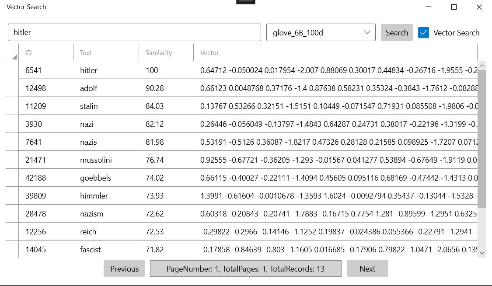
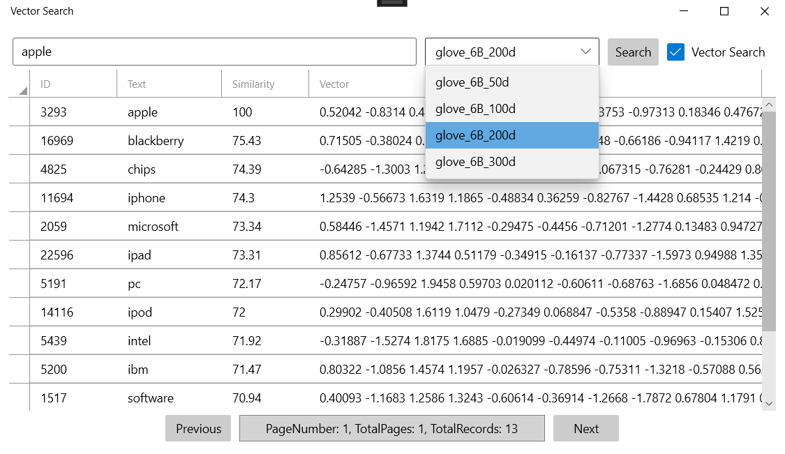

# Vector Search WPF Application

## Overview

This project is a C# WPF application that enables efficient searching and manipulation of word vectors using GloVe (Global Vectors for Word Representation) dictionaries. It provides two search approaches:

1. **Simple Search**: Performs a SQL `LIKE` query to find words.
2. **Vector Search**: Uses cosine similarity to find semantically similar words based on their vector representations.

Additionally, the application supports vector arithmetic (addition and subtraction of word vectors) to discover new words through mathematical operations on their vector representations. The results can be compared across four different GloVe dictionaries: 50, 100, 200, and 300 dimensions.

---

## Features

- **Search Approaches**:
  - **Simple Search**: Query words using SQL `LIKE`.
  - **Vector Search**: Retrieve words based on cosine similarity of vectors.
- **Vector Arithmetic**:
  - Add or subtract word vectors to compute new words.
- **Dictionary Comparison**:
  - Compare results across GloVe dictionaries with varying dimensions (50, 100, 200, and 300).
- **User-Friendly Interface**:
  - Intuitive WPF application for seamless interaction.

---

## Architecture

The application follows a layered architecture:

```
├── Domain                  # Core business logic and entities
├── ApplicationService      # Services for handling search operations
├── EntityFramework         # Data access and database interaction
├── WPF                     # User interface layer
└── README.md               # Project documentation
```

### Layers Explained:

1. **Domain**: Contains core entities and business rules.
2. **ApplicationService**: Implements services that manage search logic and vector arithmetic.
3. **EntityFramework**: Handles database interactions using Entity Framework (EF).
4. **WPF**: Provides the graphical user interface for the application.

---

## Technologies Used

- **Programming Language**: C#
- **Framework**: WPF (Windows Presentation Foundation)
- **Database**: SQL Server
- **ORM**: Entity Framework (EF)
- **GloVe Dictionaries**: Pretrained word vectors (50, 100, 200, and 300 dimensions)

---

## Installation

1. Clone the repository:

   ```bash
   git clone https://github.com/amonfared73/VectorSearch.git
   ```

2. Open the solution in Visual Studio.

3. Configure the SQL Server connection string in the `appsettings.json` file or directly in the EF configuration.

4. Run database migrations to set up the database schema:

   ```bash
   Update-Database
   ```

5. Build and run the application.

---

## Usage

1. Launch the WPF application.
2. Select a search approach:
   - Simple Search
   - Vector Search
3. Specify the GloVe dictionary to use (50, 100, 200, or 300 dimensions).
4. Enter the query word(s) or perform vector arithmetic.
5. View and compare results across dictionaries.

---

## Screenshots




## Contributing

Contributions are welcome! Feel free to fork the repository and submit pull requests.

---

## License

This project is licensed under the MIT License. See the `LICENSE` file for details.

---

## Contact

For questions or feedback, feel free to reach out via the repository: [GitHub - VectorSearch](https://github.com/amonfared73/VectorSearch).

